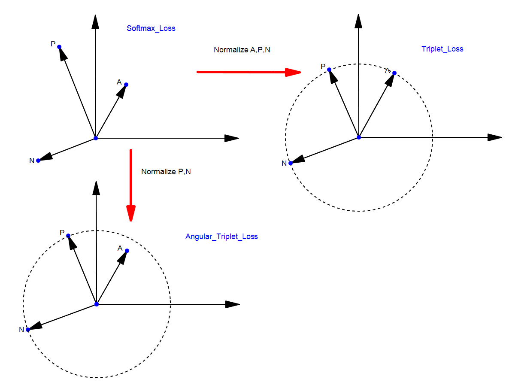
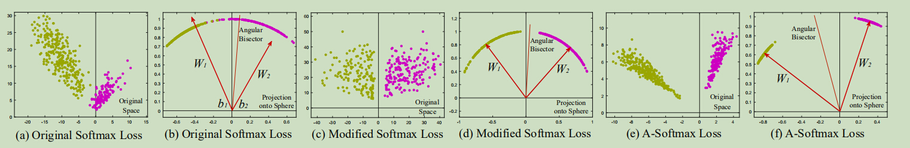
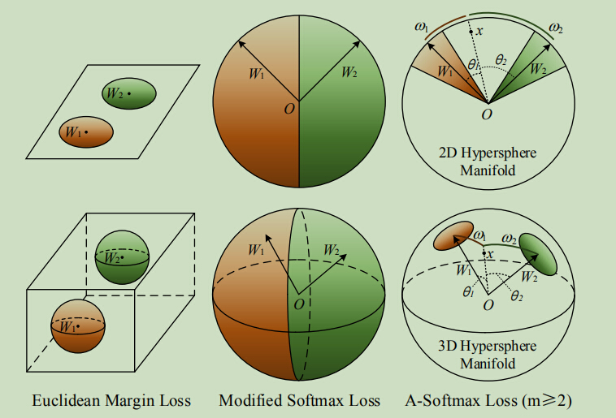
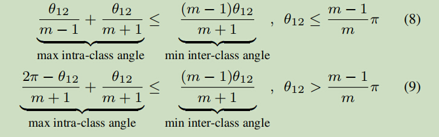
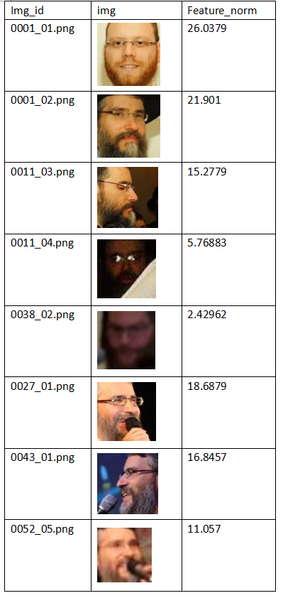
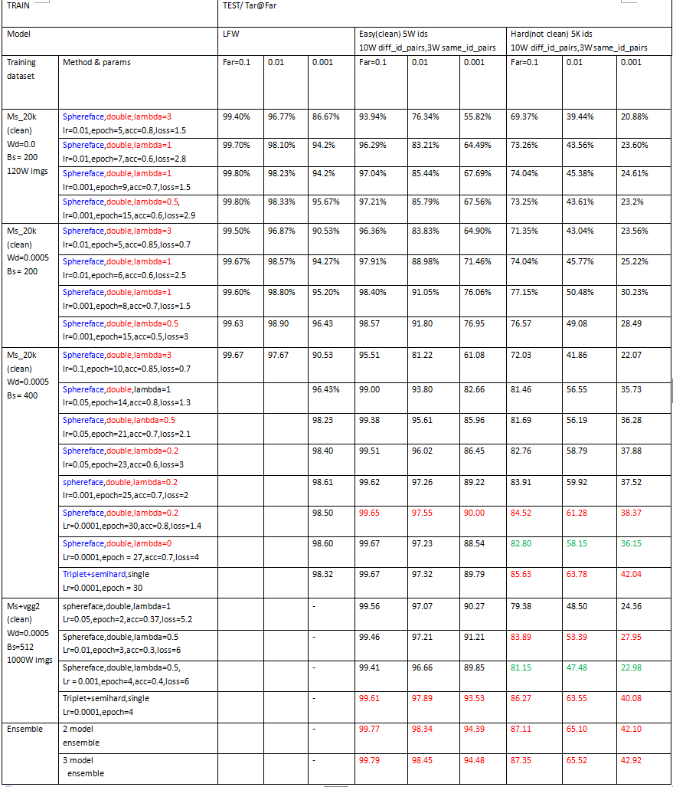
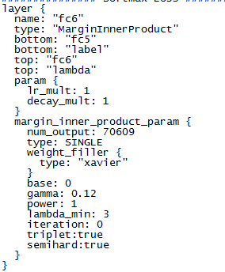

# ATL(Angular Triplet Loss)

## Theory

### basic theory

### motivation
这个loss虽然叫做angular triplet loss，但实际上是从sphereface的想法上发展出来的。

在说动机之前，先简单的分析一下sphereface。

首先是下面这张图，这是sphereface的核心思想之一：angular（论文中）：

可以看到，origin softmax是没有将weights（分类权重）归一化的，这个我在之前的project([loss functions](https://github.com/KaleidoZhouYN/Loss-Functions))中也分析过了，没有将weights归一化，那就永远属于欧式距离的范围。所以，只有将weights归一化，才能称之为cosine距离。

然后是这张图，sphereface的核心思想之二：margin（论文中）：

为什么需要这个m?就是希望它能够是样本满足 max intra-class angle < min inter-class angle。为了满足这个条件，作者推导出m=4,但是这个条件实在是太强了，强到违背了分布的规律，所以在代码中不得不加入lambda来进行调整。

在这么强的约束下，肯定是有一些样本是无法满足margin分类条件的，如果这些样本无法正确分类，然后这些样本的feature norm又很大的话，最终的loss自然会很大，所以这些样本的feature norm就会变小，这点在project([FaceRecognitionSystem](https://github.com/KaleidoZhouYN/FaceRecognitionSystem))的norm select中分析过,如下图：

显然，对于上图中0038_02来说，确实很难分辨这个人是谁，m=4的要求对于他来说肯定是约束过强了。有没有一种方法能够在满足max intra-class angle < min inter-class angle的情况下同时又能自动的选择每个样本对于的margin呢？

triplet的apn理论非常的适合。如果我们normalize p,n；只更新a。这便既满足了angular又满足了triplet特性，便是angular triplet loss。

## Implementation

triplet的随机选取apn的实现有些过于麻烦了，所以我直接基于sphereface的marginInnerProdect实现了一个Easy Triplet。

softmax是这样的，它要维护一个类中心（即分类层的权重），然后其他的样本去做分类。这个类中心在迭代的过程中不断更新，最终保持一种稳定的状态。

要命的是，这个类中心并不一定真的就是当类所有样本的中心位置。

所以在Easy Triplet里面，我舍弃了类中心的更新过程，直接把传进来的样本当成是新的类中心来做分类。具体实现可以参考代码。

同时，为了让收敛更快，我同样在代码里面实现了easy triplet的semihard example选择机制。

## Result

## Usage

## Contributor
@KaleidoZhouYN
